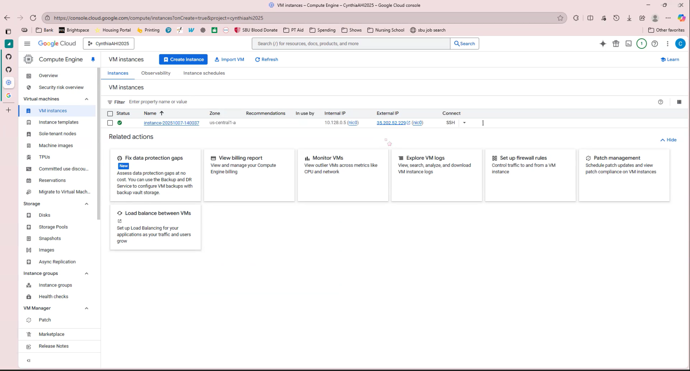
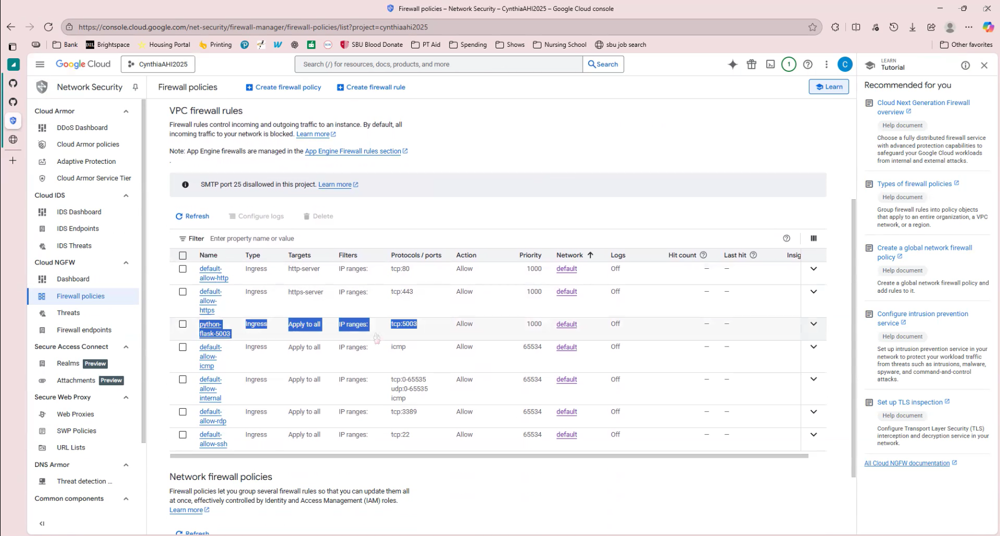
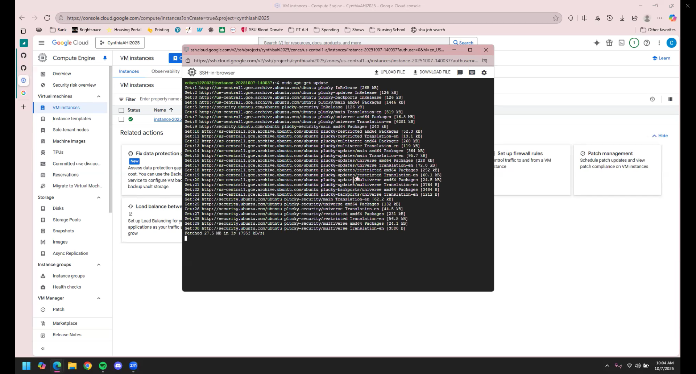
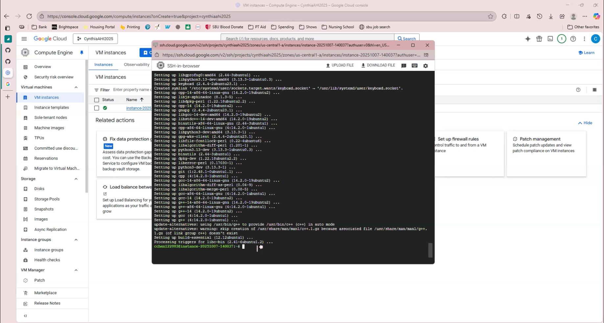
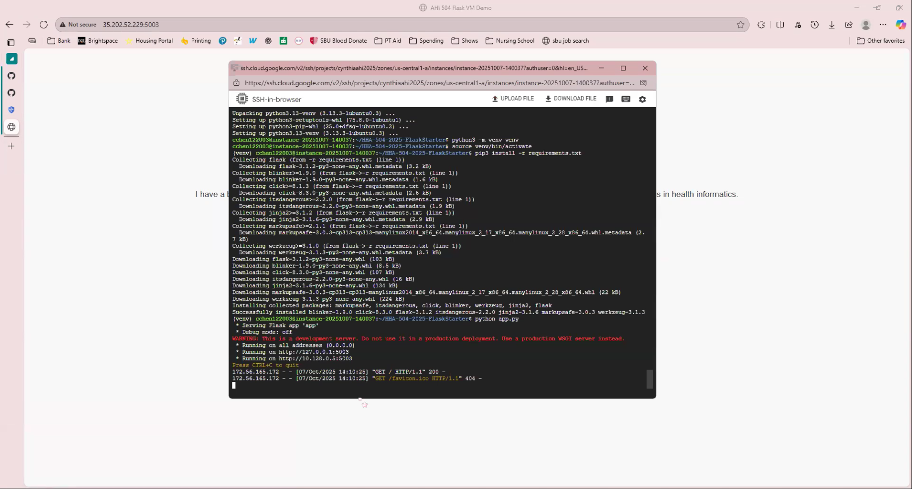
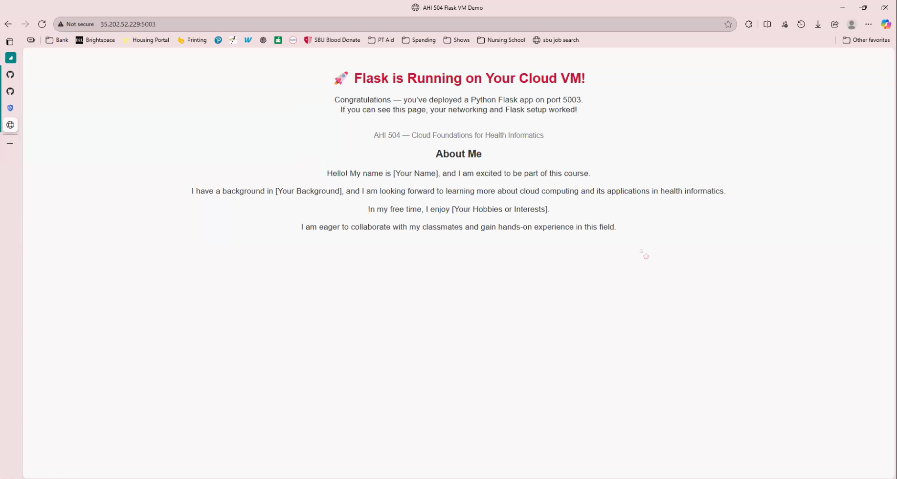

# Assignment 2 Flask on Cloud VM 

## Student Info
- Name: Cynthia Chen
- Cloud Provider: Google Cloud Platform [GCP]

## Video recording: 
- Zoom/Loom: [Deploying a Flask App](https://drive.google.com/file/d/1r7MwIj6aWf-LHcCrAOQ1xdsz_fm9WyUZ/view?usp=sharing)

## Steps
### 1. VM Creation
- Create a VM on the cloud service

### 2. Networking (Port 5003 Open)

### 3. OS Update + Python Install
- Update the OS

- Install Python and pip

### 4. Flask App Running
- Run the flask in terminal 

- Run the flask in browser

### 5. Public IP Access
URL: http://35.205.52.229:5003  

